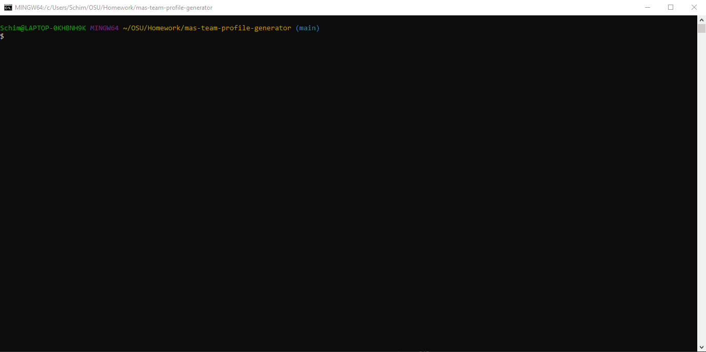

# mas-team-profile-generator

This application will generate a team profile html document. It recieves input from the user of a team name, a manager, and a number of employees (either Engineers, or Interns). This is generated using the inquirer packagefor node.js.

## Instructions

Please refer to the video located in the Media folder for a walkthrough of this application.
[Video](./Media/Instructional_Video_Team.webm)

1. The user must download the inquirer package in the terminal by using `npm i`.
2. To initiate the application in the terminal type `node index.js`. 
3. The user will be presented with a series of questions regarding the team. These will be added to the teamprofile.html file.
4. Choosing the "done adding employees' option will end the program and compile the html file.
teamprofile.html will be located in the dist folder.

## Built With

* [VSCode](https://code.visualstudio.com/) - Code editing software
* [GitBash](https://gitforwindows.org/) - Command line interface
* [node.js](https://nodejs.org/en/) - Node.js® is a JavaScript runtime built on Chrome's V8 JavaScript engine.
* [inquirer](https://www.npmjs.com/package/inquirer) - Package for node.js that will prompt users with questions.

## Authors

* **Mitch Schimmoeller** - *Programmer* - [Schimmoellerm](https://github.com/Schimmoellerm)

## Acknowledgments

* The OSU coding boot camp, its Instructor and TAs who fielded questions regarding this assignment.
* My fellow classmates for providing thoughts and ideas on how to get things working how id like.